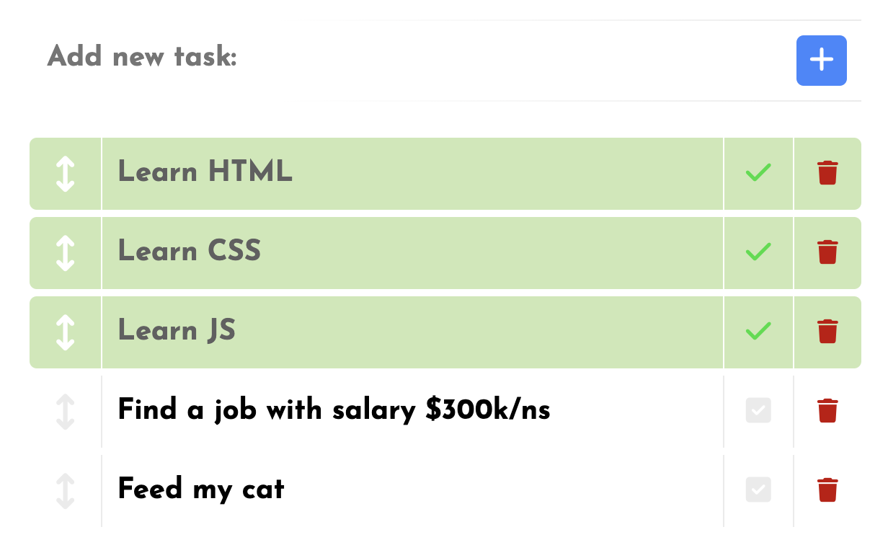

# toDoList
This is my first project in portfolio. ToDoList works on mobile and desktop browsers.
Add your task, do it, mark the progress, repeat!
Simple idea, interesting realisation!

## How to use

You can add your tasks with input field and click on blue add button or press Enter.

Mark completed tasks by clicking on the field with grey box with white check mark. It will have a green highlight background.

You can change order of your tasks according to priority.
Press and hold left area with up-down arrow icon and move the task.
Blue pointer-line will indicate place to insert the task. 
It will scroll through all the tasks in the list if you want to move the task from the end to the beginning and vice versa.
The scrolling will begin if you move the task through the half of first or last visible task in the list.

You can correct your task with double-click on area with it. Press Enter or green check mark to add correction and click anywhere or press Escape to cancel changing.

You can opt out of the task and send it to the trash with click on field with red trash basket. 
Also, you can change you decision after and restore it.
The button with trash will be active after you send task there.

With right-click (or long tap in mobile browsers) on the trash button at the bottom of screen you will open the context menu of the trash basket. 
It will delete all tasks in it or restore it back.

Also, you can open the basket to manage your deleted tasks. Choose the tasks you interested in (or press **Check all** to choose it all) and delete it with click on red trash basket button or restore it with click on green arrow.

You can see these alerts at the top of screen for 3 seconds if you will try to add empty task or the task your already have.

## Another one feature

Even if you close the browser you don`t lose your tasks.

## Try it yourself

[Click here](https://neckroot-tasklist.web.app)